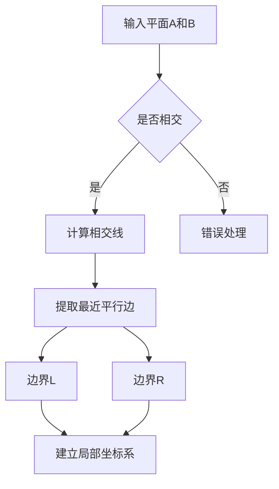
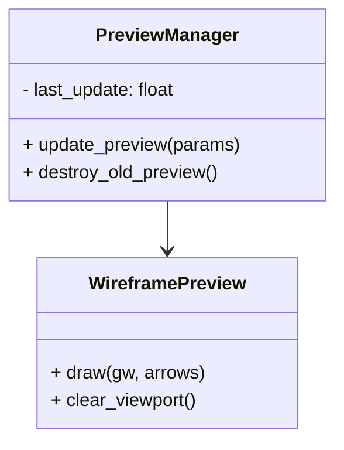
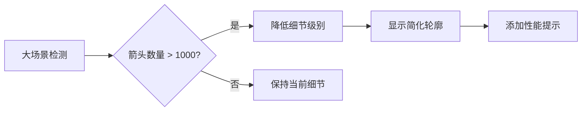

# 车道导流线生成插件开发文档

## 1. 概述
本插件用于在3ds Max中自动生成车道导流线（锯齿箭头）。用户提供两个相交的矩形平面作为边界，插件将自动识别有效区域并生成参数化的锯齿箭头平面模型。

## 2. 功能需求

### 2.1 核心功能
- 从两个相交矩形平面提取有效边界
- 参数化生成锯齿箭头平面模型
- 实时预览功能（线框模式）
- 自定义锯齿参数（宽度、高度、间距、角度）

### 2.2 输入要求
- 两个相交的矩形平面对象
- 矩形平面需在同一个坐标系中

## 3. 技术实现

### 3.1 边界提取算法


### 3.2 锯齿箭头生成算法
```python
def generate_arrows(L_edge, R_edge, params):
    # 1. 计算车道参数
    origin = calculate_origin(L_edge, R_edge)
    X_axis = calculate_direction(L_edge, R_edge)
    Y_axis = calculate_normal(L_edge, R_edge)
    length = min(edge_length(L_edge), edge_length(R_edge))
    width = average_width(L_edge, R_edge)
    
    # 2. 计算箭头参数
    W = width * params.width_ratio
    H = W * params.height_ratio
    S = W * params.spacing_ratio
    num_arrows = floor(length / S)
    
    # 3. 生成箭头网格
    mesh = Mesh()
    for i in range(num_arrows):
        pos = origin + i * S * X_axis
        
        # 计算方向（双向交替）
        dir_sign = 1 if i % 2 == 0 else -1
        
        # 计算顶点
        B = pos - (W/2) * X_axis
        C = pos + (W/2) * X_axis
        A = pos + (H * dir_sign) * Y_axis
        
        # 添加三角形
        mesh.add_face([A, B, C])
    
    # 4. 后处理
    final_mesh = weld_vertices(mesh)
    apply_UV_layout(final_mesh, params.uv_settings)
    return final_mesh
```

### 3.3 曲线适配处理
当边界为曲线时：
1. 在边界线上采样多个控制点
2. 计算每个点的局部坐标系：
   - T = normalize(Pᵢ₊₁ - Pᵢ)  # 切线方向
   - N = T × UpVector         # 法线方向
3. 箭头顶点偏移：
   - A = P + H × dir_sign × N

## 4. 实时预览系统

### 4.1 架构设计


### 4.2 线框预览实现

```maxscript
fn draw_wireframe_preview params = (
    gw = graphics_manager
    gw.setTransform(Matrix3 1)  # 世界坐标系
    
    arrows = calculate_arrows(params)
    gw.setColor #blue
    
    for arrow in arrows do (
        # 绘制三角形边框
        gw.polyline #(arrow.A, arrow.B, arrow.C) closed:true
        
        # 绘制半透明填充
        if params.show_fill then (
            gw.setColor #blue alpha:0.3
            gw.triangle arrow.A arrow.B arrow.C
        )
    )
    
    gw.updateScreen()
)
```

### 4.3 性能优化策略

1. **节流控制**：
   ```maxscript
   fn update_preview params = (
       current_time = timeStamp()
       if (current_time - last_update) < 200 then return
       
       -- 更新预览代码
       last_update = current_time
   )
   ```

2. **细节分级(LOD)**：
   | 密度 | 细节级别 | 描述 |
   |---|---|---|
   | >100 | 低 | 轮廓简化，减少线段数量 |
   | 20-100 | 中 | 基本三角形轮廓 |
   | <20 | 高 | 完整细节线框 |

3. **视锥体裁剪**：
   - 只生成相机可见区域的预览
   - 计算视锥体与车道平面的交集

## 5. 用户界面设计

### 5.1 主面板布局
```
[ 平面选择 ]
   [ 平面1: [名称显示] [拾取按钮] ]
   [ 平面2: [名称显示] [拾取按钮] ]
   
[ 箭头参数 ]
   [ 宽度比例: [70%] ▮▮▮▮▮▮▮▮▮▮▮ ]
   [ 高度比例: [33%] ▮▮▮▮▮▮▮▮▮ ]
   [ 间距比例: [150%] ▮▮▮▮▮▮▮▮▮▮ ]
   [ 锯齿角度: [60°] [旋钮] ]
   
[ 预览设置 ]
   [ 细节: ○ 高 ○ 中 ● 低 ]
   [ ☑ 实时更新 ] [ 刷新: 200ms ▼ ]
   [ ☑ 显示填充 ] [ 透明度: 30% ]
   
[ 生成按钮 ] [ 取消按钮 ]
```

### 5.2 控件说明

1. **平面选择**：
   - 显示已选平面名称
   - 拾取按钮用于选择场景中的平面

2. **箭头参数**：
   - 宽度比例：箭头底宽占车道宽度的百分比
   - 高度比例：箭头高度占底宽的百分比
   - 间距比例：箭头间距占底宽的百分比
   - 锯齿角度：箭头顶点的角度（30°-90°）

3. **预览设置**：
   - 细节：控制线框预览的精细程度
   - 实时更新：启用参数调整时的自动预览
   - 显示填充：在线框中显示半透明填充

## 6. 错误处理机制

### 错误类型及处理
| 错误类型 | 处理方式 | 用户提示 |
|----------|----------|----------|
| 平面未选择 | 禁用生成按钮 | "请选择两个平面" |
| 平面不相交 | 重置选择 | "平面不相交，请重新选择" |
| 边界不平行 | 使用平均方向 | "边界不平行，结果可能不精确" |
| 参数无效 | 重置为默认值 | "参数无效，已重置为默认值" |

### 错误提示UI
- 红色边框标注错误控件
- 状态栏显示详细错误信息
- 警告图标显示在相关参数旁

## 7. 优化建议

### 7.1 内存管理
- 设置预览对象上限（默认1000个三角面）
- 自动清理超过2分钟的预览对象
- 提供手动清除预览按钮

### 7.2 大场景处理


### 7.3 渲染优化
- 优化MaxScript绘图调用，减少重复计算
- 使用批量绘制减少图形API调用次数
- 预计算箭头位置并缓存结果，避免重复计算

## 8. 模块化架构设计

### 8.1 架构概述
插件采用模块化设计，将功能按职责分离到不同的脚本文件中，便于维护和扩展。

### 8.2 模块划分

#### 8.2.1 主控制模块 (LaneArrowMain.ms)
- **职责**：统一入口点，协调各模块工作
- **功能**：
  - 初始化插件环境
  - 加载所有子模块
  - 处理用户操作流程
  - 错误处理和状态管理

#### 8.2.2 几何计算模块 (GeometryUtils.ms)
- **职责**：提供基础几何计算功能
- **功能**：
  - 平面相交计算
  - 向量运算
  - 坐标系转换
  - 距离和角度计算

#### 8.2.3 边界提取模块 (BoundaryExtractor.ms)
- **职责**：从输入平面提取有效边界
- **功能**：
  - 检测平面相交性
  - 提取最近平行边
  - 建立局部坐标系
  - 计算车道参数

#### 8.2.4 箭头生成模块 (ArrowGenerator.ms)
- **职责**：生成锯齿箭头几何体
- **功能**：
  - 计算箭头位置和方向
  - 生成三角形网格
  - 处理曲线适配
  - 网格优化和UV展开

#### 8.2.5 预览管理模块 (PreviewManager.ms)
- **职责**：管理实时预览功能
- **功能**：
  - 线框预览绘制
  - 性能优化控制
  - 视口更新管理
  - 预览对象生命周期

#### 8.2.6 界面控制模块 (UIController.ms)
- **职责**：管理用户界面和交互
- **功能**：
  - 创建和管理UI面板
  - 处理用户输入事件
  - 参数验证和反馈
  - 状态显示和错误提示

### 8.3 模块接口设计

```maxscript
-- 主控制模块接口
struct LaneArrowController (
    fn initialize = (),
    fn loadModules = (),
    fn generateArrows inputPlanes params = (),
    fn cleanup = ()
)

-- 几何计算模块接口
struct GeometryUtils (
    fn calculateIntersection planeA planeB = (),
    fn findNearestParallelEdges planeA planeB = (),
    fn establishLocalCoordSystem edgeL edgeR = ()
)

-- 边界提取模块接口
struct BoundaryExtractor (
    fn validateInput planes = (),
    fn extractBoundaries planeA planeB = (),
    fn calculateLaneParams boundaries = ()
)

-- 箭头生成模块接口
struct ArrowGenerator (
    fn calculateArrowPositions laneParams arrowParams = (),
    fn generateMesh positions params = (),
    fn optimizeMesh mesh = ()
)

-- 预览管理模块接口
struct PreviewManager (
    fn startPreview = (),
    fn updatePreview arrows = (),
    fn stopPreview = (),
    fn setDetailLevel level = ()
)

-- 界面控制模块接口
struct UIController (
    fn createUI = (),
    fn updateUI state = (),
    fn destroyUI = (),
    fn getParameters = ()
)
```

### 8.4 模块加载和调用流程

```maxscript
-- 主脚本加载流程
filein "Scripts/GeometryUtils.ms"
filein "Scripts/BoundaryExtractor.ms"
filein "Scripts/ArrowGenerator.ms"
filein "Scripts/PreviewManager.ms"
filein "Scripts/UIController.ms"

-- 创建模块实例
global geomUtils = GeometryUtils()
global boundaryExtractor = BoundaryExtractor()
global arrowGenerator = ArrowGenerator()
global previewManager = PreviewManager()
global uiController = UIController()

-- 执行主流程
fn executeArrowGeneration = (
    -- 1. 获取用户输入
    params = uiController.getParameters()
    
    -- 2. 提取边界
    boundaries = boundaryExtractor.extractBoundaries params.planeA params.planeB
    
    -- 3. 生成箭头
    arrows = arrowGenerator.generateMesh boundaries params
    
    -- 4. 更新预览
    previewManager.updatePreview arrows
)
```

### 8.5 扩展性设计

- **插件式架构**：新功能可作为独立模块添加
- **接口标准化**：所有模块遵循统一的接口规范
- **配置驱动**：通过配置文件控制模块加载和行为
- **版本兼容**：模块版本管理，向后兼容

## 9. 测试计划

### 9.1 功能测试用例
1. 基本功能：两个平行平面生成单向箭头
2. 角度测试：不同夹角平面生成双向箭头
3. 曲线测试：弯曲平面生成适配箭头
4. 参数边界：0%和200%比例测试
5. 压力测试：生成1000+箭头

### 9.2 性能测试指标
| 场景 | 箭头数 | 预期帧率 | 最大内存 |
|------|--------|----------|----------|
| 小场景 | <50 | >60fps | <10MB |
| 中场景 | 50-200 | >30fps | <50MB |
| 大场景 | >200 | >15fps | <100MB |

### 9.3 兼容性测试
- 3ds Max 2020-2024
- Windows 10/11
- 不同DPI显示设置
- 多显示器配置

### 9.4 模块化测试
- 各模块独立功能测试
- 模块间接口测试
- 模块加载和卸载测试
- 错误处理和异常恢复测试

## 10. 发布说明

### 10.1 安装要求
- 3ds Max 2020或更高版本
- .NET Framework 4.8
- 推荐内存：8GB或更高

### 10.2 文件清单
- `LaneArrowGenerator.mzp` 主插件包
- `Scripts/` 脚本模块目录
  - `LaneArrowMain.ms` 主控制脚本
  - `GeometryUtils.ms` 几何计算模块
  - `BoundaryExtractor.ms` 边界提取模块
  - `ArrowGenerator.ms` 箭头生成模块
  - `PreviewManager.ms` 预览管理模块
  - `UIController.ms` 界面控制模块
- `README.pdf` 用户手册
- `SampleScenes/` 示例场景

### 10.3 已知限制
- 不支持非平面对象作为输入
- 极小的夹角(<5°)可能导致计算错误
- 超大场景(>1,000箭头)可能影响预览性能
- MaxScript单线程限制，复杂计算需要时间

## 11. 附录：核心数学公式

### 11.1 边界提取
```
相交线: L = PlaneA ∩ PlaneB
有效边界: 
    EdgeL = argmin_{e∈EdgesA}(distance(e, L))
    EdgeR = argmin_{e∈EdgesB}(distance(e, L))
```

### 11.2 坐标系建立
```
原点: O = midpoint(EdgeL.start, EdgeR.start)
X轴: X = normalize(avg(EdgeL.direction, EdgeR.direction))
Y轴: Y = normalize(cross(X, [0,0,1]))
```

### 11.3 曲线适配
```
切线: T = normalize(Pᵢ₊₁ - Pᵢ)
法线: N = normalize(cross(T, [0,0,1]))
顶点: 
    A = P + H·N
    B = P - (W/2)·T
    C = P + (W/2)·T
```

本文档详细描述了车道导流线生成插件的完整实现方案，包括核心算法、实时预览系统、用户界面设计和性能优化策略，为开发提供了全面指导。